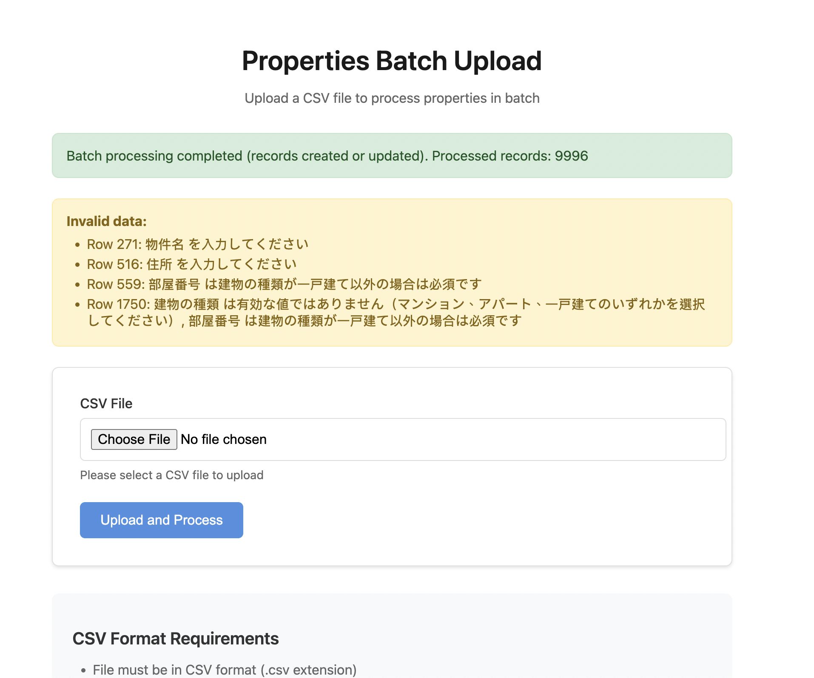

# Spacely Assessment - Property Management System

A Rails application to support for batch CSV imports and automatic record updates.

## System Requirements

- **Ruby version**: 3.4.7
- **Rails version**: 8.1.1
- **Database**: SQLite3

## Setup

### 1. Install dependencies

```bash
bundle install
```

### 2. Database setup

```bash
bin/rails db:create
bin/rails db:migrate
```

### 3. Start the server

```bash
bin/rails server
```

The application will be available at `http://localhost:3000`

## Testing
### Run all tests

```bash
bundle exec rspec
```


## Importing Properties via CSV

To import properties using a CSV file:

1. Navigate to the properties page at `/properties`
2. Upload your CSV file using the file uploader
3. The file will be processed through the `POST /properties/batch` endpoint
4. View the results, including any validation errors for invalid records


*Example of the batch upload interface showing successful processing and validation errors*


### CSV Format Requirements

Your CSV file must include the following headers in Japanese:

| Japanese Header | English Meaning | Mapped Column |
|----------------|-----------------|------------|
| ユニークID | Unique ID | custom_unique_id |
| 物件名 | Property Name | name |
| 住所 | Address | address |
| 部屋番号 | Room Number | room_number |
| 賃料 | Rent Fee | rent_fee |
| 広さ | Size | size |
| 建物の種類 | Building Type | category |


### Example CSV File

```csv
ユニークID,物件名,住所,部屋番号,賃料,広さ,建物の種類
1,サンプル物件1,東京都渋谷区1-1-1,101,100000,30,マンション
2,サンプル物件2,東京都新宿区2-2-2,202,120000,40,アパート
3,サンプル物件3,東京都目黒区3-3-3,,150000,100,一戸建て
```


## Architecture

### Property Model

Properties have the following attributes:

- `id` (UUID): Primary key
- `custom_unique_id` (integer): Unique identifier for upsert operations
- `name` (string): Property name (required)
- `address` (string): Property address (required)
- `category` (string): Building type - マンション (Apartment), アパート (Apartment), or 一戸建て (Detached House) (required)
- `room_number` (integer): Room number (required for マンション and アパート, optional for 一戸建て)
- `rent_fee` (integer): Monthly rent
- `size` (float): Property size in square meters
- `created_at`, `updated_at`: Timestamps


### PropertyBatchCreateService

The service handles batch imports of properties from CSV files and provides:

- CSV file and header validation
- Individual row validation with detailed error reporting
- Efficient batch processing (1,000 records per batch)
- Upsert operations: creates new properties or updates existing ones based on `custom_unique_id`
- Comprehensive error collection for invalid records


## Validation Rules

Properties must meet the following validation requirements:

1. **Required fields**: All properties must have `custom_unique_id`, `name`, `address`, and `category`
2. **Category values**: Must be one of the following: `マンション` (Mansion), `アパート` (Apartment), or `一戸建て` (Detached House)
3. **Room number**: Required for `マンション` and `アパート` properties, but optional for `一戸建て`
4. **Unique identifier**: Each `custom_unique_id` must be unique across all properties (used for upsert operations)


## Future Improvements

1. **Add CSV file size validation**
   - Add file size validation (e.g., 10MB limit) to the CSV uploader on the property index page and batch creating controller

2. **Back up CSV files**
   - Upload CSV files to cloud storage (or save to local storage) with a standardized naming convention
   - Example naming format: `{original_file_name}_{YYYYmmdd}-{HHMMSS}.csv`

3. **Add processing logs**
   - Create a new table (e.g., `property_batch_logs`) to track batch processing history
   - Store: file name, processed timestamp, and processing results

